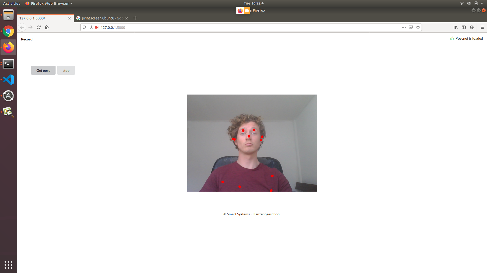

# Lab 4 and 5

For lab 4 and 5 you will need these python dependencies:

kafka-python
flask
and optionaly faust if you wish to use faust.

Before installing these dependencies you'll need to install kafka and zookeeper:

For installation on linux:
- https://tecadmin.net/install-apache-kafka-ubuntu/
For installation on Windows:
- https://www.goavega.com/install-apache-kafka-on-windows/

You can send keypoints as follows:

You will need to start zookeeper and Kafka.
Exaples are given in the links provided. 

First start the flask app in your anaconda prompt or terminal.

```
python flask_app.py
```
Now you can go to the browser and open the link as provided in the prompt:

```
http://127.0.0.1:5000/ 
```
Now you should click on load posenet and recording can start.
When you click get pose, the recording starts.
Then the stop button appears, when you click it the pose data will be send.
The data format of the pose data can be found here: https://github.com/tensorflow/tfjs-models/tree/master/posenet



In kafka you work with producers, consumers and in the middle toppics.
In producer.py, flask_app.py and consumer.py you will find the following:

json-topic

This is a placeholder topic. Both producer.py and consumer.py are starting points for you to create stream proccesing on. 

For a quick start on topic creation visit:
https://kafka.apache.org/quickstart